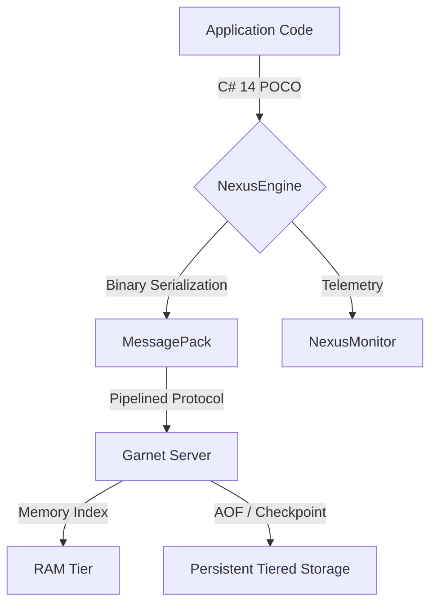

# Nexus.Store

**Nexus.Store** is an ultra-high performance, embedded key-value storage engine built for **.NET 10** and **C# 14**. It combines the raw power of **Microsoft Research Garnet** with the efficiency of **MessagePack** binary serialization to provide a world-class caching solution.


## Performance Benchmark
Nexus.Store is engineered for extreme throughput. In our latest stress tests on .NET 10, the engine achieved elite performance metrics:

| Metric | Result |
| :--- | :--- |
| **Throughput** | **240,933+ OPS** (Operations Per Second) |
| **Execution Time** | **2.08 seconds** for 500,000 records |
| **Integrity** | 100% Success rate in concurrent retrieval |
| **Efficiency** | Optimized for .NET 10 Dynamic PGO and Tiered Compilation |

## Key Features
* **Modern Stack:** Built with **C# 14** features like Primary Constructors and optimized collection deconstruction.
* **Embedded & Serverless:** No external Redis installation required. The engine runs within your application process.
* **Tiered Storage:** Intelligent RAM-to-Disk management allows handling datasets much larger than physical memory.
* **Zero-Friction API:** Simple generic methods for complex object storage.
* **Observability:** Native support for `System.Diagnostics.Metrics`, making it ready for **OpenTelemetry** and Grafana.

## Architecture Flow



## Quick Start

### 1. Dependency Injection Setup

Configure Nexus.Store in your `Program.cs` or `Startup.cs`:

```csharp
builder.Services.AddNexusStore(options => {
    options.Name = "MainCache";
    options.Address = "127.0.0.1";
    options.Port = 7005;
    options.MemoryLimit = "1g"; // Powers of 2 recommended
    options.StoragePath = Path.Combine(AppContext.BaseDirectory, "store-data");
});

```

### 2. Basic Usage

Inject the engine into your services:

```csharp
public class DataService(NexusEngine store)
{
    public async Task ProcessData(string key, MyData data)
    {
        // High-speed storage
        await store.SetAsync(key, data);
        
        // Rapid retrieval
        var cached = await store.GetAsync<MyData>(key);
    }
}

```

### 3. Bulk Operations

For massive data ingestion, use the optimized batch method:

```csharp
var items = new Dictionary<string, MyData>(); // Load your data
await store.SetBatchAsync(items); 

```

## Technology Stack

* **Runtime:** .NET 10 (CoreCLR)
* **Storage Engine:** [Microsoft Garnet](https://github.com/microsoft/garnet)
* **Serialization:** [MessagePack-CSharp](https://github.com/neuecc/MessagePack-CSharp)
* **Protocol:** Redis Serialization Protocol (RESP)

## 📄 License

This project is licensed under the MIT License.
